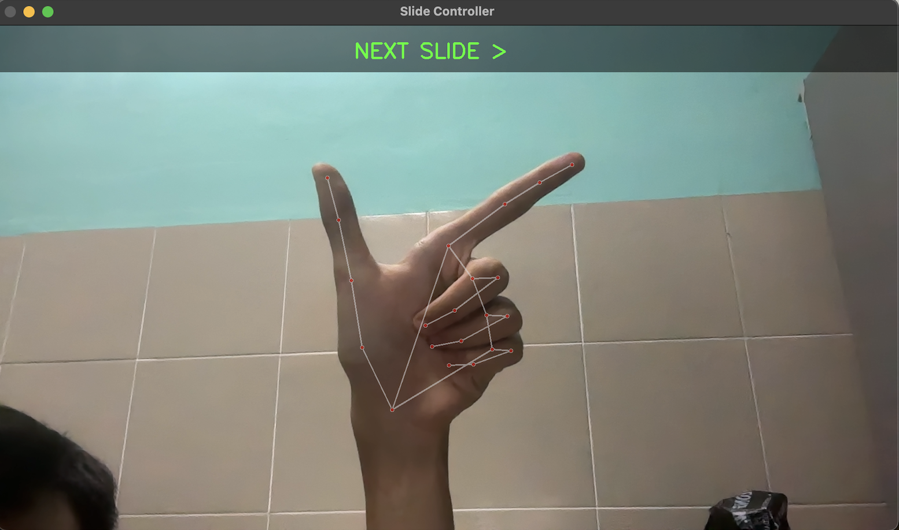
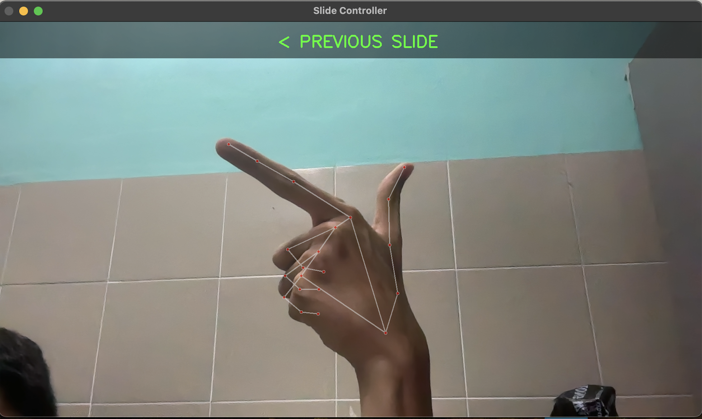

# Hand Gesture Slide Controller 🖐️📽️

## Project Overview

Instead of hitting the books during finals, I channeled my exam stress into creating a cutting-edge hand-gesture slide controller. This MediaPipe-powered application transforms presentation navigation, proving that procrastination can spark unexpected technical innovation.

## Features

- 🎥 Real-time hand gesture detection
- 🖱️ Control slides using simple hand movements
- 💻 Compatible with Preview app on Mac
- 🖼️ On-screen notifications
- 🌈 Intuitive gesture recognition

## Prerequisites

- Python 3.8+
- Webcam
- Mac with Preview app

## Installation

### 1. Clone the Repository
```bash
git clone https://github.com/Aidirrr/slide-controller.git
cd slide-controller
```

### 2. Create Virtual Environment
```bash
# On macOS/Linux
python3 -m venv venv
source venv/bin/activate

# On Windows
python -m venv venv
venv\Scripts\activate
```

### 3. Install Dependencies
```bash
pip install -r requirements.txt
```

## How to Use

1. Open Preview with your slideshow
2. Run the script
3. Make hand gestures in front of your webcam:
   - **Next Slide**: Move hand right with index and thumb spread
   - **Previous Slide**: Move hand left with index and thumb spread
4. Press 'q' to quit the application

### Gesture Tutorial

#### Next Slide
- Open your hand
- Extend index finger and thumb
- Move hand from left to right
- Index finger should be to the right of thumb

#### Visual Guide for Next Slide


#### Previous Slide
- Open your hand
- Extend index finger and thumb
- Move hand from right to left
- Index finger should be to the left of thumb

#### Visual Guide for Previous Slide


## Technical Details

- **Computer Vision Library**: MediaPipe
- **Image Processing**: OpenCV
- **Automation**: PyAutoGUI
- **Gesture Detection**: Custom algorithm using hand landmark tracking

## Performance Tips

- Use in good lighting
- Keep hand fully visible in webcam
- Maintain 2-3 feet distance from camera
- Make deliberate, distinct gestures

## Troubleshooting

- Ensure all dependencies are installed
- Check webcam permissions
- Verify Python version compatibility

## Contributing

Contributions, issues, and feature requests are welcome! Feel free to check [issues page](https://github.com/Aidirrr/slide-controller/issues).

## License

[MIT](https://choosealicense.com/licenses/mit/)

## Disclaimer

Created during final exam season - productivity levels may vary! 😄

## Contact

Khaidhir - [LinkedIn](www.linkedin.com/in/khaidhir)

Project Link: [https://github.com/Aidirrr/slide-controller](https://github.com/Aidirrr/slide-controller)